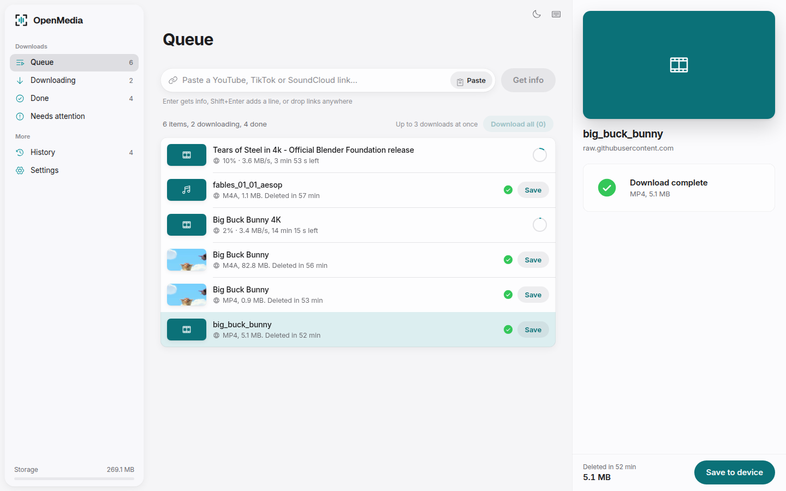
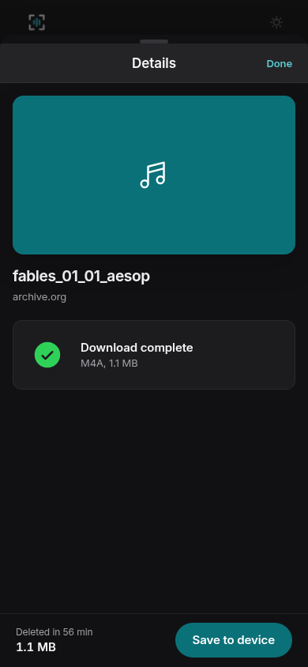

<div align="center">
  
  <h1>OpenMedia</h1>
  <p>Download videos from almost any website. Lightweight, self-hosted media downloader with a clean web UI.</p>
  <p>
    <a href="https://github.com/ttncode/openmedia/actions/workflows/ci.yml"></a>
    <a href="https://github.com/ttncode/openmedia/releases"></a>
    <a href="https://github.com/ttncode/openmedia/stargazers"></a>
    <a href="LICENSE"></a>
  </p>
  <p>English | <a href="README.vi.md">Tiếng Việt</a></p>
</div>

## Features

- Downloads from 1000+ sites through yt-dlp
- MP4 and MKV video with a quality picker
- MP3, M4A, Opus, FLAC and WAV audio
- Trimming to a time range
- Subtitles, embedded or as a separate SRT file
- Cover art, metadata and chapters embedded in the file
- A queue with live progress, cancel and a concurrency limit
- Bulk links and playlists
- Cookies for age-restricted or bot-checked videos
- Optional password, rate limiting and private-network blocking
- History, drag and drop, paste anywhere, keyboard shortcuts
- Installable PWA with a share target
- Light and dark themes with seven accent colors
- English and Vietnamese

<div align="center">
  
  
</div>

## Installation

### Docker Compose

Download `compose.yaml` and `example.env` from the
[latest release](https://github.com/ttncode/openmedia/releases/latest), then
copy the example settings:

```bash
cp example.env .env
```

Edit `.env` and set `OPENMEDIA_PASSWORD` to a password of your own. The API
refuses to start while it is still `changeme`; leave it empty only for a
private local instance. Then start the stack:

```bash
docker compose up -d
```

Open `http://localhost:8080`.

### Installer script

```bash
curl -fsSL https://github.com/ttncode/openmedia/releases/latest/download/install.sh | bash
```

The installer generates a random password and prints it with the address when
it finishes.

### From source

```bash
git clone https://github.com/ttncode/openmedia.git
cd openmedia
mise install
mise run //apps/api:dev
mise run //apps/web:dev
```

Open `http://localhost:3000`.

## Documentation

- [Getting started](docs/getting-started.md)
- [Usage](docs/usage.md)
- [Configuration](docs/configuration.md)
- [Deployment](docs/deployment.md)
- [Troubleshooting](docs/troubleshooting.md)
- [Security](docs/security.md)

## For Developers

Every config root (`apps/api`, `apps/web`, `docs`) answers the same task
contract: `install`, `format`/`format-fix`, `lint`, `check`, `test`, `build`,
`ci-unit`, `checklist`. Run one root's checks with `mise run
//apps/api:ci-unit`, or `mise run checklist` from the project root to run
every root, which is exactly what CI runs.

| Path       | What lives there                  |
| ---------- | --------------------------------- |
| `apps/api` | Flask backend, yt-dlp integration |
| `apps/web` | Next.js web UI                    |
| `docs`     | This documentation site           |

See [CONTRIBUTING.md](CONTRIBUTING.md) for the branch and commit conventions.

## Get Help

- [Troubleshooting guide](docs/troubleshooting.md)
- [Report a problem](https://github.com/ttncode/openmedia/issues)
- [Security policy](SECURITY.md)

## Acknowledgments

- [ReClip](https://github.com/averygan/reclip), the project OpenMedia is built on
- [yt-dlp](https://github.com/yt-dlp/yt-dlp)
- [FFmpeg](https://ffmpeg.org)
- [Deno](https://deno.com)
- [Next.js](https://nextjs.org)
- [Flask](https://flask.palletsprojects.com)
- [Phosphor Icons](https://phosphoricons.com)
- The [scaffold](https://github.com/ttncode/scaffold) toolbox this project was generated with

## Disclaimer

OpenMedia is for personal use. Respect copyright law and the terms of service
of the sites you download from.

## License

MIT, see [LICENSE](LICENSE) and [NOTICE](NOTICE).
